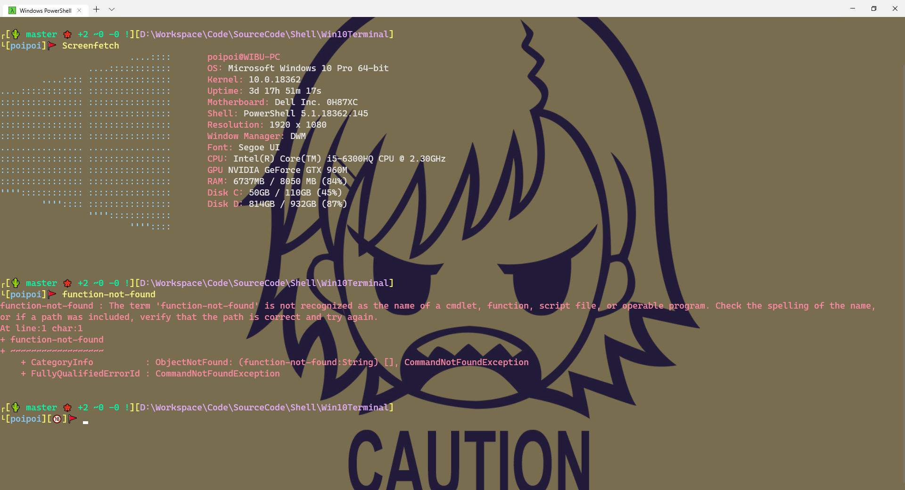

# Set up a your dev enviroment on Windows 10 (Powershell + Window terminal + Scoop)

1. Install window new [terminal](https://github.com/microsoft/terminal)
   - Config: <https://github.com/microsoft/terminal/blob/master/doc/cascadia/SettingsSchema.md>
   - Add context menu for terminal : <https://github.com/microsoft/terminal/issues/1060#issuecomment-518000678>
   - You can find custom color for terminal at: <https://github.com/mbadolato/iTerm2-Color-Schemes/tree/master/windowsterminal>
   - Work best with [Cascadia Code font](https://github.com/microsoft/cascadia-code)

2. Powwershell Modules:
   - [**Get-ChildItemColor**](https://github.com/joonro/Get-ChildItemColor)
   - [**posh-git**](https://github.com/dahlbyk/posh-git)
   - [**oh-my-posh**](https://github.com/JanDeDobbeleer/oh-my-posh)
   - [**PsReadLine v2.0**](https://github.com/PowerShell/PSReadLine)
   - [**windows-screenfetch (optional)**](https://github.com/JulianChow94/Windows-screenFetch)

3. Scoop
   - Install : <https://github.com/lukesampson/scoop>
   - Use scoop to install other developer tool. Eg: [sudo (very useful imo)](http://blog.lukesampson.com/sudo-for-windows), git, java,...

4. Update Windows Open SSH

   Window now come with [OpenSSH](https://github.com/PowerShell/openssh-portable). But the default version seem a bit buggy. If you are using git with ssh and add a ssh key with password, every git pull/push/fetch command you are required to enter password again (not sure if it is my fault or not, but after update open ssh, everything ork fine). Update guide: <https://github.com/PowerShell/Win32-OpenSSH/wiki/Install-Win32-OpenSSH>

5. Setup your powershell profile with [this](resources/Microsoft.PowerShell_profile.ps1)

6. Custom theme [DarkBlood](resources/Darkblood.psm1) (you can set other theme in powershell profile)

7. Visit <http://xahlee.info/comp/unicode_index.html> to make fun with unicode icon on your terminal (like my screenshot 😁)
